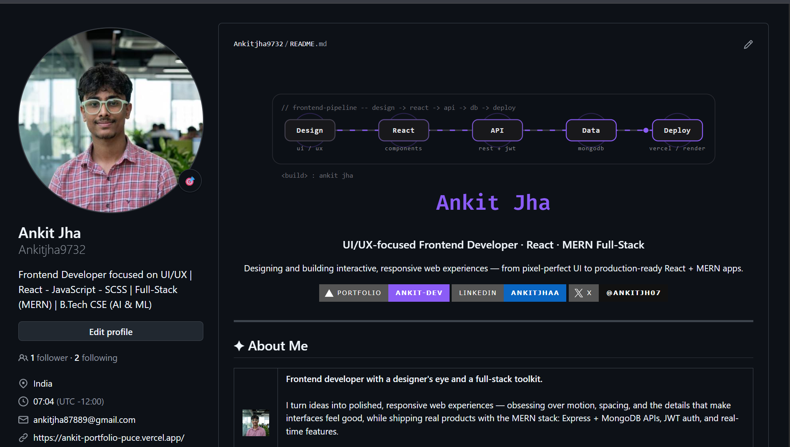

# 🚀 Build Your GitHub Profile with AI

This guide helps students and developers create a professional GitHub profile README using AI and their own real information.

---

## 👀 See My Profile

Want to see what the result can look like?

👉 **[View My GitHub Profile](https://github.com/Ankitjha9732)**

Use my profile as inspiration. Don't copy my information — build yours with your own skills, projects, and experience.

---

## ⚡ How to Build Yours

### 1. 📝 Prepare Your Information

- Name
- Short introduction
- Skills / tech stack
- 2–3 projects
- Education / experience
- GitHub, LinkedIn, and portfolio links

### 2. 🤖 Copy the AI Prompt

**[🚀 Open the Profile Prompt →](./prompts/profile-prompt.md)**

Copy the prompt and paste it into ChatGPT, Claude, Gemini, or your preferred AI assistant.

### 3. 💬 Give AI Your Information

Replace the `[PLACEHOLDERS]` with your real information.

> Never allow AI to invent projects, skills, achievements, or experience.

### 4. 📄 Generate & Review

Check that the output is accurate:

- Information is correct
- Projects are real
- Skills are real
- Links work
- No fake achievements

### 5. 🐙 Create Your GitHub Profile

1. Create a public repository with exactly the same name as your GitHub username
2. Add `README.md`
3. Paste the generated Markdown
4. Commit the changes

### 6. 📌 Improve Your Profile

- Pin your best repositories
- Add good repository descriptions
- Add project READMEs
- Add screenshots and live demo links

### 7. 📱 Check Your Profile

View your profile on both desktop and mobile to make sure everything looks good.

### 8. 🎉 Done

Your GitHub profile is ready. Keep updating it as you learn and build.

---

## 🤖 More AI Prompts

| Goal | Prompt |
|---|---|
| Create Profile | [🤖 Profile Prompt](./prompts/profile-prompt.md) |
| Create Project README | [📄 Project Prompt](./prompts/project-readme-prompt.md) |
| Improve Profile | [✨ Improve Prompt](./prompts/improve-profile-prompt.md) |

---

## 📋 Quick Checklist

- [ ] Professional profile README
- [ ] Clear introduction
- [ ] Real skills
- [ ] 2–3 strong projects
- [ ] Good project READMEs
- [ ] LinkedIn / portfolio
- [ ] Best repositories pinned
- [ ] No fake information
- [ ] No API keys or secrets

---

## 📄 Template

Prefer editing manually? Start with the **[📋 Ready-Made Template →](./templates/profile-readme-template.md)**

---

## 🤝 Contributing

Have an improvement or idea? See **[CONTRIBUTING.md](./CONTRIBUTING.md)**.

---

> Built from my own experience improving my GitHub profile.

**GitHub:** [github.com/Ankitjha9732](https://github.com/Ankitjha9732)

If this guide helped you, consider giving it a ⭐.
